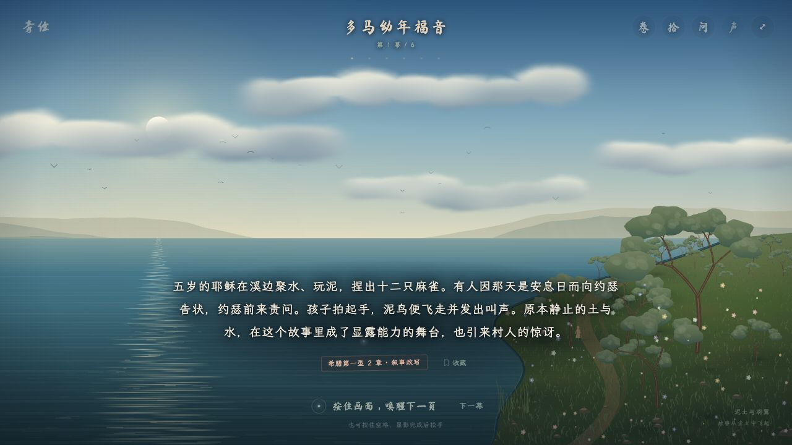
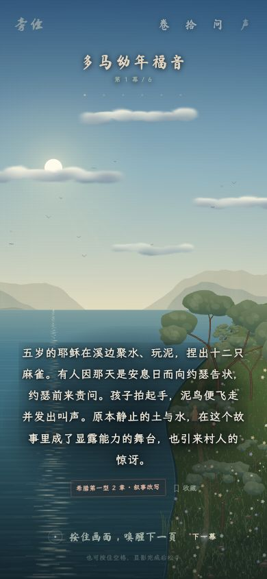

# 第二版：向 God Simulator 的实际设计学习

用户反馈：第一版审美明显不及 GitHub 上 Claude 制作的原作，需要认真对照学习。

## 对照与基线

- 原作远端：`MikhailXiaomaikou/God-simulator`，提交 `0a364d282d36edc01ecaf7af21d6d2627b9f87ba`。本机 `index.html` 的 Git blob 与远端一致：`ff46215bde078edb6d7c76ab9937c7ea36c7138a`。
- 已实际打开原作开场与伊甸，观察全屏构图、云层、海面反光、近岸树木和动物、书法标题与边缘工具。
- SIDE BIBLE 基线：`80851e6`。旧成品和截图另存 `artifacts/side-bible-before-cinematic.*`，原内容数据、存档格式与原作不改。
- 新分支：`codex/side-bible-cinematic`。本轮不合并主分支或部署站点。

## 第一版的问题

左文案、右插画、页脚和常驻导航把作品做成介绍网页。几何山脊、悬空门与星盘是装饰符号，不能提供原作的连续空间和自然细节。固定 1.4 秒长按、立即替换旁白，也缺少事件发生后的停顿。

原作的 `CLAUDE.md` 并没有审美秘诀；设计质量来自画面为主的布局、专门的中文字体、自然渲染、按段落安排的事件与时间。

## 本轮设计

- **构图**：全屏连续地景；封面居中只留“旁经”、SIDE BIBLE、操作提示。进入后封面退去，卷名与工具缩至屏幕边缘。上部出现言说，下部展开旁白。
- **色彩**：深墨 `#030810`、夜蓝 `#0c2338`、月白 `#c0d8e5`、草木 `#394737`、纸白 `#efe7d9`、朱砂 `#8f3e32`。场景有实际晨、昼、暮、夜变化，不再统一灰蓝金。
- **字体**：志莽行书用于标题和言说；马善政用于卷名；霞鹜文楷用于阅读。字体从原始开放字体来源获取，附 OFL，按实际字符子集化并内嵌离线成品。
- **地景**：天空、远山、水、近岸属于同一空间。连续山脊、柔软云层、透视水纹、树与花草、飞鸟和人物替换悬浮几何插画；建筑与生物落在地面上。
- **节奏**：画面也可以长按，字符逐个显现；释放后场景发生变化，旁白随后出现。保留单击阅读，允许读者主动加快，取消长按不改变进度。
- **克制**：删除首页式宣传语、主按钮与页脚，不添加成绩徽章或更多装饰。原典定位与正典差异继续可访问。

```text
                卷名 / 幕次                         卷 拾 源 声 ?

                       言说逐字浮现

                 云、远山、水、近岸与生灵

                   旁白在事件之后展开
                        原典出处
                 按住显影        轻点翻页
```

验收重点：相同桌面尺寸下与基线截图对照；实际按住画面、提前释放、文字显现、场景变化、跨卷与存档恢复；手机布局与减少动态效果。测试数量不作为审美进步的证明。

## 实现与复核

上述改造已完成。对实际截图进行了第二轮调整：提高日景云、水与植被层次；消除云纹理硬边及水面三角形光带；保留手机近景树木的可辨尺寸。全屏景物、正文和来源各有可阅读的位置。






72 幕完整浏览器流程、旧存档恢复及 51 项自动检查已完成，详见 `VERIFICATION.md`。画面与原作仍各有实现差异，是否达到用户期待，以实际游玩和视觉反馈判断。
